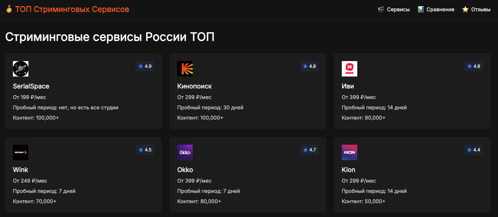

# Сравнение стриминговых сервисов в Росссии



GIT https://github.com/valdipelh/TopStream.git

Веб-приложение для сравнения стриминговых сервисов России, помогающее пользователям выбрать оптимальный сервис для просмотра фильмов и сериалов.

## 🚀 Возможности

- Сравнение различных стриминговых сервисов
- Подробная информация о каждом сервисе
- Отзывы пользователей и рейтинги
- Удобная сортировка и фильтрация
- Адаптивный дизайн для всех устройств

## 📱 Основные страницы

- **Главная страница**: Карточки сервисов и сравнительная таблица
- **Страница сравнения**: Детальное сравнение сервисов
- **Страницы сервисов**: Подробная информация о каждом сервисе
- **Отзывы**: Мнения пользователей о сервисах

## 🛠 Технологии

- [Astro.js](https://astro.build/) - Современный фреймворк для создания быстрых веб-сайтов
- [Tailwind CSS](https://tailwindcss.com/) - Утилитарный CSS-фреймворк
- [TypeScript](https://www.typescriptlang.org/) - Типизированный JavaScript
- [Inter](https://rsms.me/inter/) - Современный шрифт

## 🎨 Дизайн

- Темная тема
- Современный и чистый интерфейс
- Карточный дизайн для списка сервисов
- Цветовая схема:
    - Фон: `#121212`
    - Фон карточек: `#1e1e1e`
    - Акцентные цвета:
        - Оранжевый: `#ff6600`
        - Синий: `#3b82f6`

## 📊 Информация о сервисах

Для каждого сервиса предоставляется:
- Логотип и рейтинг
- Информация о тарифах и пробном периоде
- Детали библиотеки контента
- Спецификации качества видео и звука
- Доступные платформы
- Отзывы пользователей
- Прямая ссылка на сайт сервиса

## 🚀 Запуск проекта

```bash
# Установка зависимостей
npm install

# Запуск в режиме разработки
npm run dev

# Сборка для продакшена
npm run build

# Предпросмотр собранного проекта
npm run preview
```

## 📱 Поддерживаемые платформы

- Веб-браузеры
- Мобильные устройства
- Smart TV
- Игровые консоли (для некоторых сервисов)

## 🔍 Функции сравнения

- Сравнение цен и тарифов
- Анализ библиотеки контента
- Сравнение качества видео
- Оценка пользователей
- Выделение топ-3 сервисов

## 📝 Отзывы

- Имя пользователя
- Рейтинг (1-5 звезд)
- Дата отзыва
- Текст отзыва
- Расчет среднего рейтинга
- Сортировка по дате/рейтингу
- Фильтрация по сервису

## 🔒 Требования к системе

- Node.js 18 или выше
- Современный веб-браузер
- Подключение к интернету

## 📈 Производительность

- Быстрая загрузка страниц
- Оптимизированные изображения
- SEO-оптимизация
- Отзывчивый интерфейс

## 🤝 Вклад в проект

Мы приветствуем вклад в развитие проекта! Если у вас есть предложения по улучшению или вы нашли ошибку, пожалуйста, создайте issue или отправьте pull request.

## 📄 Лицензия

Проект распространяется под лицензией MIT. Подробности смотрите в файле LICENSE.